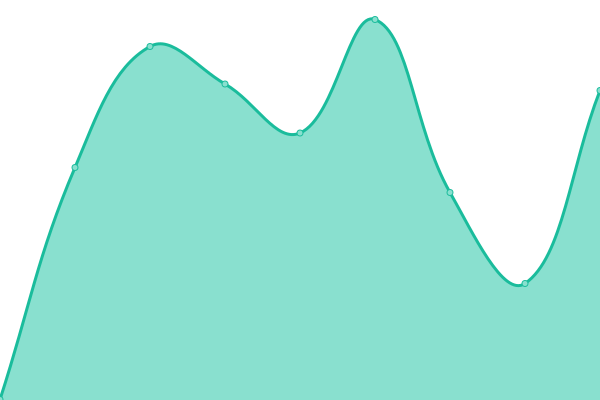
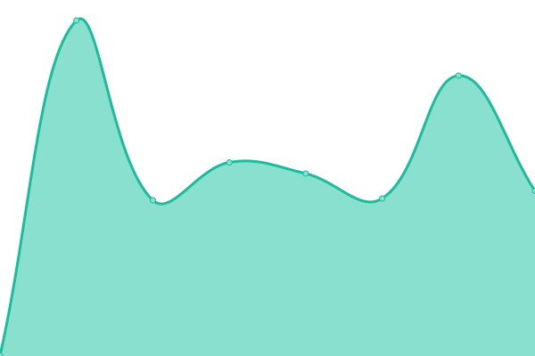
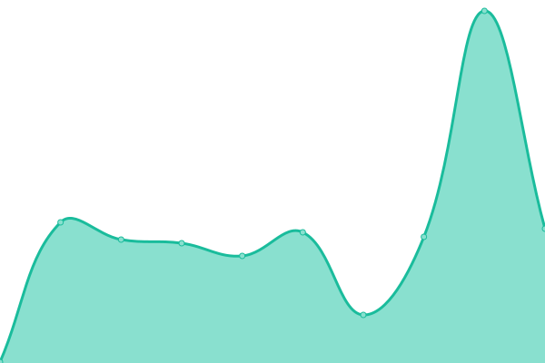
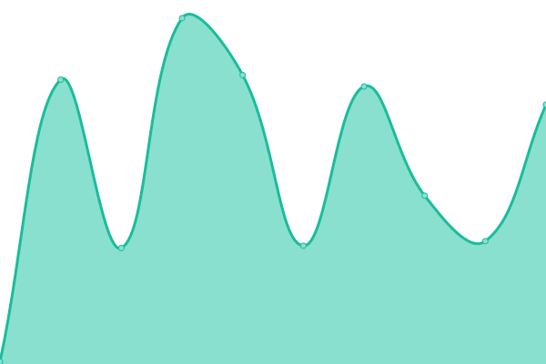

# [📈 Live Status](https://status.zyrouge.gq): <!--live status--> **🟧 Partial outage**

This repository contains the open-source uptime monitor and status page for [ZYROUGE](https://zyrouge.gq), powered by [Upptime](https://github.com/upptime/upptime).

With [Upptime](https://upptime.js.org), you can get your own unlimited and free uptime monitor and status page, powered entirely by a GitHub repository. We use [Issues](https://github.com/zyrouge/status.zyrouge.gq/issues) as incident reports, [Actions](https://github.com/zyrouge/status.zyrouge.gq/actions) as uptime monitors, and [Pages](https://status.zyrouge.gq) for the status page.

<!--start: status pages-->
<!-- This summary is generated by Upptime (https://github.com/upptime/upptime) -->
<!-- Do not edit this manually, your changes will be overwritten -->
<!-- prettier-ignore -->
| URL | Status | History | Response Time | Uptime |
| --- | ------ | ------- | ------------- | ------ |
|  [Main](https://zyrouge.gq) | 🟥 Down | [main.yml](https://github.com/zyrouge/status.zyrouge.gq/commits/HEAD/history/main.yml) | 

 554ms
     
 | 

<a href="https://status.zyrouge.gq/history/main">99.99%</a>
    

|  [Backend](https://server.zyrouge.gq/ping) | 🟩 Up | [backend.yml](https://github.com/zyrouge/status.zyrouge.gq/commits/HEAD/history/backend.yml) | 

 429ms
     
 | 

<a href="https://status.zyrouge.gq/history/backend">100.00%</a>
    

|  [Guides](https://guides.zyrouge.gq) | 🟩 Up | [guides.yml](https://github.com/zyrouge/status.zyrouge.gq/commits/HEAD/history/guides.yml) | 

 248ms
     
 | 

<a href="https://status.zyrouge.gq/history/guides">100.00%</a>
    

|  [Genius-Lyrics Docs](https://genius-lyrics.zyrouge.gq) | 🟩 Up | [genius-lyrics-docs.yml](https://github.com/zyrouge/status.zyrouge.gq/commits/HEAD/history/genius-lyrics-docs.yml) | 

 264ms
     
 | 

<a href="https://status.zyrouge.gq/history/genius-lyrics-docs">100.00%</a>
    

|  [Keyvify Docs](https://keyvify.js.org) | 🟩 Up | [keyvify-docs.yml](https://github.com/zyrouge/status.zyrouge.gq/commits/HEAD/history/keyvify-docs.yml) | 

 134ms
     
 | 

<a href="https://status.zyrouge.gq/history/keyvify-docs">100.00%</a>
    

|  [Skyceil (JSDoc Theme)](https://skyceil.zyrouge.gq) | 🟩 Up | [skyceil-js-doc-theme.yml](https://github.com/zyrouge/status.zyrouge.gq/commits/HEAD/history/skyceil-js-doc-theme.yml) | 

 198ms
     
 | 

<a href="https://status.zyrouge.gq/history/skyceil-js-doc-theme">100.00%</a>
    

<!--end: status pages-->

[**Visit our status website →**](https://status.zyrouge.gq)

## 📄 License

- Powered by: [Upptime](https://github.com/upptime/upptime)
- Code: [MIT](./LICENSE) © [ZYROUGE](https://zyrouge.gq)
- Data in the `./history` directory: [Open Database License](https://opendatacommons.org/licenses/odbl/1-0/)
